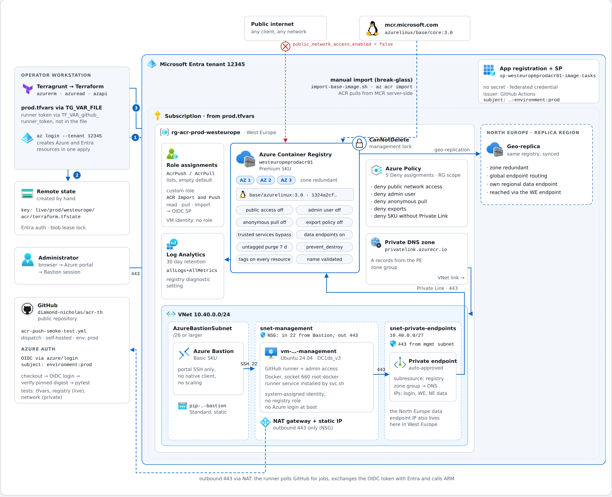

# azure-acr



Part 2 CVSS Task Design: https://canva.link/k9gbv3ziuo92xwd

This repository contains a Terragrunt + Terraform deployment for a private Azure Container Registry with a management VM and Azure Bastion. The current live configuration is a private ACR deployment with a management path separated from the registry network, and it supports a self-hosted GitHub runner running inside the VNet for private registry access.

The design intentionally separates human admin access from application delivery workflows. Azure Bastion is used for operator access to the private management VM, while the runner and pipeline operate within the private network and authenticate to Azure using GitHub OIDC and the VM's managed identity rather than long-lived service-principal secrets.

## Current architecture

- Private-only ACR with `public_network_access_enabled = false`
- Private endpoint and private DNS zone for `azurecr.io`
- Management subnet with a Linux VM behind NAT and no public IP
- Azure Bastion for human administrative access
- Azure Policy denying public access, admin user use, anonymous pull, and export
- Terraform remote state stored in a separate Azure Storage account using Entra auth
- Deletion protection via Terraform `prevent_destroy` and an Azure `CanNotDelete` lock
- Optional self-hosted runner installation for private CI jobs

## Security notes

- Secrets must be kept out of source control. Use GitHub OIDC, managed identity, or another secure secret store for pipeline credentials.
- Keep `*.tfvars` files out of Git.
- The service principal or federated identity used for registry operations should be least privilege and rotated on a schedule.
- Prefer GitHub OIDC and managed identity over long-lived service-principal secrets for both the runner and the VM bootstrap path.
- The VM system-assigned managed identity is used for Azure CLI login when needed, but the registry should not be granted broad AcrPush access to a general-purpose admin VM.
- Local Python environments such as `.venv/` are never committed; keep them out of Git while versioning repo validation scripts.

## Usage

```bash
cp example.tfvars prod.tfvars
# populate the file with your environment values

# authenticate to Azure with the identity that will run Terraform / OIDC
az login

cd live/prod/westeurope/acr

TG_VAR_FILE=../../../../prod.tfvars terragrunt plan
TG_VAR_FILE=../../../../prod.tfvars terragrunt apply
```

`TG_VAR_FILE` is used because Terragrunt also needs the tfvars values when configuring the remote backend.

## Network access model

```text
Human:  Administrator → Bastion → Management VM → ACR private endpoint
CI:     GitHub self-hosted runner → private network → ACR private endpoint
Registry:  Private network only; no public registry endpoints
```

## Private CI / ACR import flow

The repository includes a GitHub Actions workflow that runs on a self-hosted runner inside the private network and authenticates to Azure with GitHub OIDC, not a client secret.

This pattern is intentionally aligned with a private ACR deployment model:

- the runner is placed inside the same VNet as the registry path
- ACR is reachable only through the private endpoint
- the workflow authenticates with the least-privilege Azure identity through `azure/login@v2`
- Terraform creates the registry and then invokes the ACR `importImage` action with the pinned digest so the registry starts from a known-good base image
- the workflow validates the imported digest and checks that the private network path behaves as expected

This is a secure private-network CI pattern for a private registry workload and matches the import-first workflow intended for this environment.

## Pipeline behavior

This repo includes a GitHub Actions smoke test workflow that:

- authenticates to Azure with GitHub OIDC and no long-lived client secret
- checks out the repo
- confirms the pinned Azure Linux image digest matches the expected value
- validates the private ACR import path without re-importing a mutable tag on each run

The workflow is designed for a private-network CI model, and it is appropriate when the runner is isolated, patched, and limited to the required registry access path. No static Azure client secret is required; the identity is federated via GitHub and scoped to the ACR.

The script at [scripts/import-base-image.sh](scripts/import-base-image.sh) remains available as a manual break-glass option for ad hoc import work, but the normal workflow path verifies the pinned digest instead of re-running import on every execution.

## Testing plan

The repo uses three validation layers:

1. Static checks: the Terraform and tfvars parsing checks in [tests/test_example_tfvars.py](tests/test_example_tfvars.py).
2. Live registry checks: the Azure SDK checks in [tests/test_registry.py](tests/test_registry.py), which use `DefaultAzureCredential` and run under OIDC in GitHub Actions.
3. Network checks: the private-endpoint validation in [tests/test_network.py](tests/test_network.py), which runs only on the private runner and confirms the ACR resolves to the VNet address range and returns 401 from the registry root.

For local validation, keep the Python test environment local to the repo with:

```bash
python3 -m venv .venv
. .venv/bin/activate
python -m pip install -r tests/requirements.txt
pytest -q tests
```

The Python validation scripts in [tests](tests) are part of the repo and should be committed because they protect the tfvars contract and the live registry assumptions before deployment.

## Working assumptions

This repo is a sound private-registry baseline and supports a real private CI workflow. It is not yet a fully hardened production CI/CD design, but it is aligned with a legitimate self-hosted private-runner model for Azure Container Registry workloads and has been validated with a successful image push to the private registry.

## Areas to improve

- Continue to use GitHub OIDC and managed identity instead of static Azure client secrets.
- Add approval gates and branch protection for registry image pushes.
- Add image scanning and policy enforcement before pushing to production tags.
- Consider tag immutability, retention policies, and image signing for provenance.
- Add monitoring and alerting around ACR push activity, registry events, and runner access.
- Review whether the custom ACR role for image tasks is sufficient for all required task operations.
- Use a dedicated GitHub OIDC app registration or workload identity with minimal scope instead of a broader application registration where possible.
- Add pre-commit checks, linting, and policy validation for Terraform.
- Consider separate production and non-production repositories or naming conventions to reduce accidental promotion risk.

## Destroy

Deletion is protected by Terraform `prevent_destroy` and an Azure `CanNotDelete` lock. Both must be removed before destruction.
